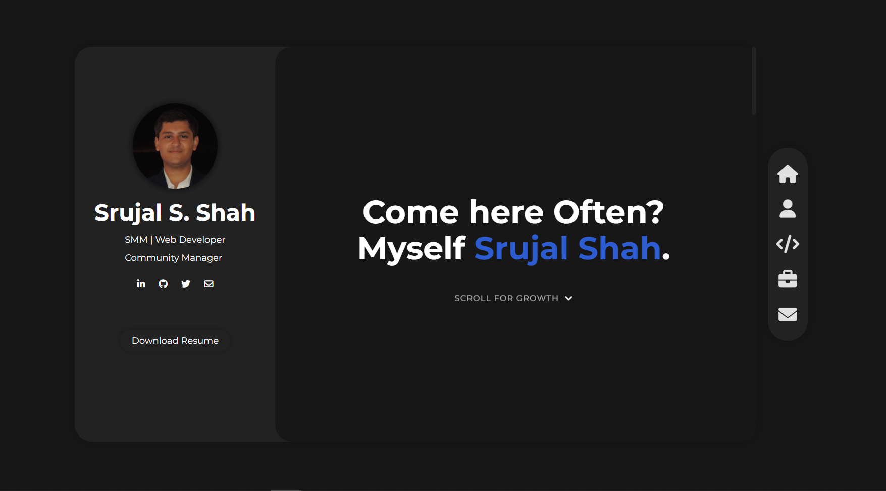

# MiniFolio - Minimalist Portfolio Template

A clean, modern, and responsive portfolio template built with HTML, CSS, and JavaScript. Perfect for developers, designers, and creative professionals looking to showcase their work in a minimalist and elegant way.



## Features

- Fully responsive design
- Modern and minimalist UI
- Smooth scrolling navigation
- Project showcase with modals
- Integrated contact form
- Experience timeline
- Social media integration
- Skills and language proficiency display
- Mobile-friendly navigation menu

## Quick Start

1. **Clone the repository**
   ```bash
   git clone https://github.com/yourusername/minifolio.git
   cd minifolio
   ```

2. **Configure Web3Forms Integration**
   - Sign up at [Web3Forms](https://web3forms.com/)
   - Get your access key
   - Replace the access key in `index.html`:
     ```html
     <input type="hidden" name="access_key" value="YOUR_ACCESS_KEY_HERE">
     ```

3. **Configure Google Sheets Integration (Optional)**
   - Set up Google Apps Script
   - Update the fetch URL in the form submission code
   - Add your deployment ID to the script URL

4. **Customize Content**
   - Update `index.html` with your information
   - Replace images in the `img` folder
   - Modify styles in `style.css` if desired

## 📝Customization Guide

### 1. Personal Information
- Open `index.html`
- Update the following sections:
  - Profile picture (`header-img`)
  - Name and title
  - Social media links
  - About me text
  - Skills list
  - Language proficiencies

### 2. Projects
- Locate the projects section in `index.html`
- For each project, update:
  ```html
  <div class="project-tile">
      
      <div class="project-title">Project Name</div>
      <div class="project-description">
          <h3>Project Title</h3>
          <p>Project description...</p>
          <div class="project-links">
              <a href="github-link">GitHub</a>
              <a href="demo-link">Live Demo</a>
          </div>
      </div>
  </div>
  ```

### 3. Experience Timeline
- Find the experience section
- Add/modify timeline items:
  ```html
  <div class="timeline-item">
      <div class="timeline-date">Date</div>
      <div class="timeline-content">
          <h3>Position @ Company</h3>
          <p>Description...</p>
      </div>
  </div>
  ```

### 4. Styling
- Colors: Edit CSS variables in `style.css`:
  ```css
  :root {
      --accent-color: #2d5bd0;
      --background-color: #171717;
      --background-color-2: #222222;
      --light-grey: #e0e0e0;
      --text-color: #ffffff;
  }
  ```

## Responsive Design

The template is fully responsive and includes:
- Mobile-first approach
- Breakpoints for different screen sizes
- Touch-friendly navigation
- Optimized images and modals for mobile devices

## Technical Details

- **Form Handling**: Uses Web3Forms for email notifications
- **Data Storage**: Optional Google Sheets integration
- **Animations**: CSS transitions and keyframes
- **Icons**: Font Awesome integration
- **Typography**: Google Fonts (Montserrat)

## 📄 License

This project is licensed under the MIT License - see the [LICENSE](LICENSE) file for details.

## 🤝 Contributing

Contributions are welcome! Please feel free to submit a Pull Request.

---

Made with ❤️ by [Srujal Shah]

For questions or support, please [open an issue](https://github.com/techking007/Srujal-s-Minifolio/issues).
